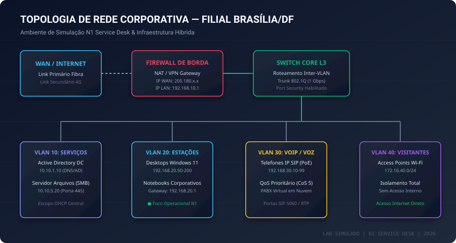

# Portfólio Técnico N1 Service Desk & Customer Experience Lab

<div align="center">


</div>

---

## 🎯 Apresentação & Objetivo Profissional

Olá! Sou um profissional de Suporte de Tecnologia focado em **Experiência do Cliente (Customer Experience - CX) e Service Desk N1**, sediado em **Brasília/DF** e com total disponibilidade para a jornada das **10:00 às 19:00**.

Este repositório foi construído como uma **Prova Prática e Visual de Trabalho (Proof of Work)**. Em vez de declarações genéricas ou experiências infladas, este portfólio reúne **evidências técnicas auditáveis, laboratórios práticos, roteiros estruturados de diagnóstico, scripts funcionais e um sistema completo de ITSM demonstrativo**.

> **Minha Missão no N1:**
> *“Entender a solicitação com empatia, diagnosticar o problema com método técnico, atender o usuário de forma humanizada, registrar o chamado com precisão ITIL, aplicar soluções resolutivas de primeiro nível, documentar na Base de Conhecimento e escalar assertivamente quando necessário.”*

---

## 🧭 Visão Rápida para o Recrutador e RH (Menos de 2 minutos)

Se você tem pouco tempo, aqui está o resumo do que você encontrará implementado neste repositório:

1. **Sistema de ITSM Funcional:** Aplicação web interativa simulando o ciclo de vida real de incidentes e requisições, cálculo dinâmico de prioridade (Impacto × Urgência) e fluxo de resolução/escalonamento.
2. **Framework ITIL v4 Aplicado:** Documentação clara que distingue Incidentes, Requisições, Problemas e Mudanças, aliada a templates formais de atendimento e regras de SLA.
3. **Casos Técnicos Práticos de Troubleshooting:** Soluções documentadas para falhas de rede (TCP/IP, DHCP, DNS), Spooler de impressão, lentidão no Windows (Disco 100%), corrupção de perfis, clientes Linux, Active Directory e falhas físicas de hardware.
4. **Foco Estratégico em Experiência do Cliente (CX):** Modelos de abordagem para usuários sob pressão, perfis não técnicos e usuários frustrados com foco na escuta ativa e na redução do estresse operacional.
5. **Automação Útil e Segura:** Scripts em PowerShell e Bash voltados para auditoria rápida de estações, testes de conectividade e limpeza preventiva de temporários com confirmação explícita.
6. **Governança de Dados & KCS:** Telemetria simulada de 384 chamados mensais (FCR 81.5%, SLA 96.8%, CSAT 4.92) e transformação de incidentes repetitivos em artigos de FAQ e capacitação de usuários.

---

## 🛠️ Mapa de Competências da Vaga × Evidências no Portfólio

| Requisito da Vaga (N1 CX) | Onde está demonstrado no Repositório | Arquivo / Diretório de Evidência |
| :--- | :--- | :--- |
| **Suporte Windows 10/11** | 6 Casos reais de diagnóstico (Spooler, lentidão, login temporário, SFC/DISM) | `labs/windows-troubleshooting/README.md` |
| **Diagnóstico Linux** | Comandos práticos (`ip`, `systemctl`, `journalctl`, `df -h`, `ss`) | `labs/linux-troubleshooting/README.md` |
| **ITIL v4 & ITSM** | Sistema ITSM operacional interativo + Documentação conceitual | `docs/ITIL.md` & `app/server.js` |
| **Active Directory (AD DS)** | Gestão de OUs, usuários, desbloqueio, reset de senha e auditoria de BadPwdCount | `labs/active-directory/README.md` |
| **Contas e Permissões** | Princípio do menor privilégio, grupos de segurança e scripts PowerShell | `automation/powershell/` |
| **Redes e Conectividade** | TCP/IP, IPv4, DNS, DHCP, APIPA, VLANs, Wi-Fi e topologia de filial | `labs/networking/README.md` & `assets/diagramas/` |
| **Hardware & Periféricos** | Diagnóstico físico de notebooks, bips sonoros, docking stations e monitores | `labs/hardware/README.md` & `knowledge-base/` |
| **E-mail & M365** | Resolução de perfil corrompido, cache OST, autenticação e mitigação de phishing | `knowledge-base/email/KB-EML-001.md` |
| **Telefonia / VoIP** | Suporte a aparelhos SIP (PoE), QoS, Teams Phone e áudio unidirecional | `labs/voip/README.md` |
| **Customer Experience (CX)** | Roteiros de comunicação humanizada, acolhimento de perfis e escuta ativa | `docs/CUSTOMER_EXPERIENCE.md` |
| **Matriz de Escalonamento** | Regras de transição N1 ➔ N2/N3 com ficha técnica de handover | `docs/ESCALATION_MATRIX.md` |
| **Base de Conhecimento & FAQ** | 10 Artigos estruturados padrão KCS + FAQ de autoatendimento | `knowledge-base/` & `knowledge-base/FAQ.md` |
| **Automação em Scripts** | Diagnóstico rápido de máquina e manutenção preventiva | `automation/powershell/` e `automation/bash/` |
| **Análise de Recorrência** | Dashboard de métricas, KPIs operacionais e plano de treinamento | `itsm/reports/monthly-report.md` |

---

## 🧠 Meu Processo de Troubleshooting (Como eu Penso)

Quando um chamado é atribuído ou um usuário entra em contato, não inicio reiniciando a máquina aleatoriamente. Sigo um método analítico, seguro e humanizado:

```text
 1. ACOLHER       Escuta ativa da dor do usuário; tranquilizar e validar o impacto imediato.
      ↓
 2. REGISTRAR     Classificar o chamado no ITSM (Incidente vs. Requisição) e calcular Impacto × Urgência.
      ↓
 3. INVESTIGAR    Coletar evidências objetivas (mensagens de erro literais, logs do sistema, testes de rede).
      ↓
 4. ISOLAR        Aplicar modelo de camadas (Física ➔ Enlace ➔ Rede ➔ Transporte ➔ Aplicação).
      ↓
 5. SOLUCIONAR    Aplicar o procedimento documentado na Base de Conhecimento com menor impacto possível.
      ↓
 6. VALIDAR       Pedir para o usuário testar a rotina real de trabalho e confirmar o restabelecimento do serviço.
      ↓
 7. DOCUMENTAR    Registrar no ticket as ações realizadas, comandos rodados e tempo de atendimento.
      ↓
 8. PREVENIR      Identificar se a falha é recorrente para propor atualização de KB, FAQ ou automação preventiva.
      ↓
 9. ESCALAR       Se a demanda exigir acesso além da alçada do N1, realizar handover estruturado sem retrabalho.
```

---

## 🖥️ Topologia de Rede Corporativa da Filial Brasília/DF

Diagrama conceitual representando a infraestrutura da filial simulada, demonstrando a visão sistêmica necessária para suporte corporativo:

<div align="center">



</div>

---

## 📊 Sistema ITSM Demonstrativo (Em Execução)

A aplicação de ITSM deste repositório está ativa no ambiente e fornece uma experiência completa de gerenciamento de chamados:

* **Porta do Servidor:** `http://localhost:3000` (ou preview web na nuvem)
* **Funcionalidades:**
  * Visualização em tempo real de chamados na fila N1.
  * Cálculo dinâmico da matriz Impacto × Urgência = Prioridade ITIL.
  * Abertura de novos chamados com categorização em dois níveis.
  * Atualização de status (*Em Atendimento*, *Resolvido*, *Escalado*).
  * Registro de feedback de satisfação do usuário (CSAT).
  * Ficha de escalonamento para N2/N3 com justificativa técnica.

---

## 📚 Base de Conhecimento (KCS) & Artigos Técnicos

A pasta `knowledge-base/` contém artigos técnicos padronizados seguindo a taxonomia oficial:

1. **[KB-WIN-001](knowledge-base/windows/KB-WIN-001.md):** Destravamento do Spooler de Impressão local via PowerShell
2. **[KB-WIN-002](knowledge-base/windows/KB-WIN-002.md):** Mitigação de lentidão no Windows (Disco 100% e Windows Update)
3. **[KB-WIN-003](knowledge-base/windows/KB-WIN-003.md):** Recuperação de login em perfil temporário (Registro do Windows)
4. **[KB-NET-001](knowledge-base/networking/KB-NET-001.md):** Resolução de falhas de conexão de rede e endereço APIPA 169.254.x.x
5. **[KB-NET-002](knowledge-base/networking/KB-NET-002.md):** Diagnóstico de falha de resolução DNS em ambientes de domínio
6. **[KB-LNX-001](knowledge-base/linux/KB-LNX-001.md):** Guia prático de comandos de suporte Linux (rede, disco, logs)
7. **[KB-AD-001](knowledge-base/windows/KB-AD-001.md):** Desbloqueio seguro de usuários e investigação de BadPwdCount no AD
8. **[KB-EML-001](knowledge-base/email/KB-EML-001.md):** Correção de sincronização OST, Outlook desconectado e tokens M365
9. **[KB-HDW-001](knowledge-base/hardware/KB-HDW-001.md):** Resolução de falhas em múltiplos monitores e saídas de vídeo
10. **[KB-PER-001](knowledge-base/peripherals/KB-PER-001.md):** Troubleshooting de microfone e headset USB no Microsoft Teams
11. **[KB-BRW-001](knowledge-base/browser/KB-BRW-001.md):** Correção de certificados inválidos e cache web corporativo
12. **[FAQ Oficial de Autoatendimento](knowledge-base/FAQ.md):** As 10 dúvidas mais comuns respondidas em linguagem clara

---

## 🔒 Segurança da Informação & Conformidade

* Todos os dados, hostnames, IPs e nomes de usuários apresentados neste repositório são **100% fictícios e simulados para fins de demonstração**.
* Nenhuma senha real, token de API ou segredo de infraestrutura é exposto.
* Arquivo `.gitignore` configurado estritamente para impedir vazamento de dados de configuração.
* Scripts e operações respeitam o **Princípio do Menor Privilégio** e exigem confirmação explícita antes de qualquer exclusão de dados temporários.

---

## 🤝 Contato & Disponibilidade

* **Função Almejada:** Técnico de Experiência do Cliente N1 / Service Desk N1
* **Localidade:** Brasília/DF
* **Carga Horária:** 10:00 às 19:00 (Segunda a Sexta-feira)
* **Disponibilidade para Início:** Imediata

<div align="center">
  <sub>Este repositório foi desenvolvido seguindo os mais elevados padrões de governança ITSM, ITIL v4 e Customer Experience.</sub>
</div>
